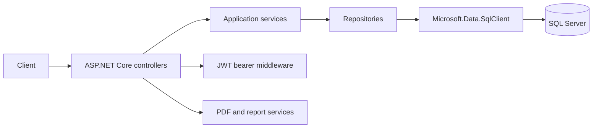

# WebApiUdApp

An ASP.NET Core REST API for user accounts, publications, comments, moderation, and report generation.

## Overview

WebApiUdApp exposes HTTP workflows for the UdApp social platform, including account registration and login, publication management, comments, moderation, and downloadable reports. The code is organized into controllers, services, repositories, and shared utilities. It uses SQL Server through `Microsoft.Data.SqlClient`, JWT bearer authentication, and Swagger for API exploration.

## Key Features

- User registration and login with JWT issuance
- Publication creation, retrieval, updates, reporting, and likes
- Comment workflows and user-scoped access
- Moderator endpoints for reported content
- Report-generation and download endpoints
- Swagger/OpenAPI UI and JWT bearer configuration
- ASP.NET Core middleware for CORS, authentication, authorization, and error handling

## Architecture



Controllers handle HTTP concerns, services coordinate application behavior, and repositories provide data access. The current database implementation uses `SqlConnection` and SQL Server; although Entity Framework Core is referenced by the project, the documented request path is based on `SqlClient`.

## Tech Stack

- **Backend:** C#, ASP.NET Core, .NET 8
- **Database access:** SQL Server, Microsoft.Data.SqlClient
- **Authentication:** JWT bearer authentication
- **API documentation:** Swashbuckle / Swagger
- **Reporting:** iText 7, PuppeteerSharp, Rotativa, SkiaSharp
- **Security package:** Konscious Argon2 package reference

## Project Structure

```text
WebApiUdApp/Controllers/    HTTP endpoints
WebApiUdApp/Services/       Application and database services
WebApiUdApp/Repositories/   Data access
WebApiUdApp/Dtos/           Request and response contracts
WebApiUdApp/Utilities/      Middleware and shared utilities
Documentación/              Existing user and technical manuals
WebApiUdApp.sln             Visual Studio solution
```

## Demo

A public demo is not currently verified. The API depends on SQL Server, and the current repository configuration must be secured and made environment-specific before database-backed workflows are safe to run or expose publicly.

## Getting Started

### Prerequisites

- .NET 8 SDK
- A SQL Server instance for database-backed endpoints

### Restore and run

From the repository root:

```bash
dotnet restore WebApiUdApp.sln
dotnet run --project WebApiUdApp/WebApiUdApp.csproj
```

Use the URL printed by ASP.NET Core and open `/swagger` to explore the API. A clean clone does not provide a supported external database configuration workflow yet, so database-backed requests require the connection configuration to be corrected first.

## API

Selected routes declared by the controllers:

| Method | Path | Purpose |
|---|---|---|
| `POST` | `/api/Usuario/Login` | Authenticate a user and issue a JWT |
| `POST` | `/api/Usuario/Registro` | Register a user |
| `GET` | `/api/Publicaciones/publicacion-por-id?id={id}` | Retrieve a publication by ID |
| `GET` | `/api/Publicaciones/pagina-principal` | Retrieve the authenticated user's feed |

The feed endpoint is marked with `[Authorize]`; Swagger is configured with a Bearer authorization scheme. See the controller source for request DTOs and response details.

## Testing and CI

No automated test project or GitHub Actions workflow is present in this repository. Build and restore can be checked with the .NET SDK commands above; endpoint verification requires a correctly configured SQL Server.

## Security

JWT bearer authentication is configured and selected routes require authorization. **Do not deploy this repository as-is:** database credentials are present in tracked source/configuration files. Treat them as compromised, rotate the database credential, remove secrets from tracked files, and replace them with environment variables or .NET user secrets before running against a real database. A source change alone does not revoke previously exposed credentials.

## Engineering Decisions

- **Controller/service/repository separation:** keeps HTTP request handling, application behavior, and persistence responsibilities distinct.
- **JWT bearer authorization:** supports authenticated publication and administration workflows without coupling authorization to controller routing.
- **SQL Server access through SqlClient:** the current repository implementation uses explicit SQL connections and commands, so this README does not claim an Entity Framework-based persistence layer.

## Future Improvements

- Externalize all database and JWT settings and rotate credentials previously committed to the repository.
- Add automated tests for authentication, authorization, and database-backed endpoints.
- Provide a reproducible local SQL Server setup and sanitized seed data.